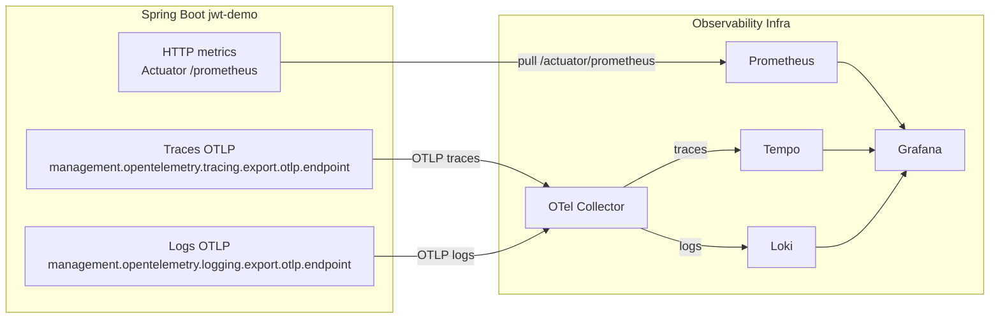

```markdown
# 🔐 Spring Boot + Keycloak OAuth2 Proxy  
Dynamic authentication with client-provided `client_id` and `client_secret`

This project implements a clean, production-ready OAuth2 proxy in front of Keycloak.  
The backend does **not** store client credentials for login/refresh/logout.  
Instead, the client sends them in each authentication request, making the system flexible, multi-tenant, and secure.

For **opaque token introspection**, the resource server uses **service credentials** (env vars) to validate tokens and enable immediate logout.

Supported features:
- 🔑 Username/password login  
- 🔄 Token refresh  
- 🚪 Logout (refresh token revocation)  
- 🔐 DPoP support (proof forwarding to Keycloak + proof validation for protected endpoints)  
- 🛡 Opaque token validation via Spring Security introspection  
- 🎭 Role-based authorization (ADMIN, CLIENT_CREATE, CLIENT_GET, CLIENT_SEARCH, UPDATE_BALANCE)  
- 🔎 Client search endpoint with dedicated role `CLIENT_SEARCH`
- 🚦 Configurable rate limiting (Bucket4j)  
- ⏱ Persistent Quartz scheduler for asynchronous client creation requests
- 💳 Account balance endpoints with pessimistic/optimistic locking
- 📬 Request-status endpoint for asynchronous operations
- 🧪 Full integration test suite
- 📦 Automatic Keycloak realm import (users, roles, mappers)
- 🧪 WireMock for negative testing (network failures, timeouts, error responses)
- 📊 OpenTelemetry tracing and JSON logging
- 📈 Prometheus metrics via Actuator
- 📚 Swagger/OpenAPI documentation

---

## 📦 Tech Stack

- Java 25
- Spring Boot 4.0.3
- Spring Security (Resource Server)
- Spring Web (REST)
- Keycloak 26+
- Bucket4j core + custom servlet filter
- Quartz Scheduler (JDBC job store)
- JUnit 5 + RestTemplate-based integration tests
- Testcontainers (Keycloak)
- WireMock (Negative testing)
- OpenTelemetry + Logstash encoder
- Micrometer + Prometheus
- Docker Compose  

> Baseline verified on JDK 25 with `Lombok 1.18.44` and `JaCoCo 0.8.14`.

---

## 🚀 Running the Project

### 0. Configure environment variables

Create a `.env` file from the template and set real values:

```bash
copy .env.example .env
```

Required variables:

- `KEYCLOAK_DB_PASSWORD`
- `APP_DB_PASSWORD`
- `KEYCLOAK_ADMIN_PASSWORD`
- `GRAFANA_ADMIN_PASSWORD`

Resource server introspection credentials (confidential client in Keycloak):

- `KEYCLOAK_RESOURCE_CLIENT_ID`
- `KEYCLOAK_RESOURCE_CLIENT_SECRET`

### 1. Start Keycloak (with automatic realm import)

```bash
docker compose up -d
```

Keycloak automatically imports:

- realm `my-realm`
- users (`user`, `admin`)
- roles (`ADMIN`, `CLIENT_CREATE`, `CLIENT_GET`, `CLIENT_SEARCH`, `UPDATE_BALANCE`, `offline_access`)
- client `spring-app`
- protocol mappers (roles → access_token)

Keycloak UI:

```
http://localhost:8080
```

### 2. Start Spring Boot

```bash
mvn spring-boot:run
```

Application runs at:

```
http://localhost:8081
```

Swagger UI:

```
http://localhost:8081/swagger-ui/index.html
```

OpenAPI JSON:

```
http://localhost:8081/v3/api-docs
```

---

## 📚 Swagger / OpenAPI

The OpenAPI spec is generated automatically at runtime. Use Swagger UI to explore and try endpoints.

Helpful links:

- Swagger UI: `http://localhost:8081/swagger-ui/index.html`
- OpenAPI JSON: `http://localhost:8081/v3/api-docs`

---

## ⚙️ Configuration (`application.properties`)

```properties
server.port=8081

keycloak.realm=my-realm
keycloak.auth-server-url=http://localhost:8080

# Service credentials for introspection (resource server)
keycloak.resource-client-id=${KEYCLOAK_RESOURCE_CLIENT_ID}
keycloak.resource-client-secret=${KEYCLOAK_RESOURCE_CLIENT_SECRET}

keycloak.token-url=${keycloak.auth-server-url}/realms/${keycloak.realm}/protocol/openid-connect/token
keycloak.logout-url=${keycloak.auth-server-url}/realms/${keycloak.realm}/protocol/openid-connect/logout
keycloak.introspection-url=${keycloak.auth-server-url}/realms/${keycloak.realm}/protocol/openid-connect/token/introspect

spring.security.oauth2.resourceserver.opaque-token.introspection-uri=${keycloak.introspection-url}
spring.security.oauth2.resourceserver.opaque-token.client-id=${keycloak.resource-client-id}
spring.security.oauth2.resourceserver.opaque-token.client-secret=${keycloak.resource-client-secret}

# DPoP validation
security.dpop.enabled=true
security.dpop.max-proof-age=5m
security.dpop.clock-skew=30s
security.dpop.replay-cache-size=100000

# Persistent Quartz jobs in PostgreSQL
spring.quartz.job-store-type=jdbc
spring.quartz.jdbc.initialize-schema=never
spring.quartz.properties.org.quartz.scheduler.instanceName=jwt-demo-scheduler
spring.quartz.properties.org.quartz.jobStore.class=org.springframework.scheduling.quartz.LocalDataSourceJobStore
spring.quartz.properties.org.quartz.jobStore.driverDelegateClass=org.quartz.impl.jdbcjobstore.PostgreSQLDelegate
spring.quartz.properties.org.quartz.jobStore.tablePrefix=QRTZ_
spring.quartz.properties.org.quartz.jobStore.isClustered=true

# Rate limiting
app.rate-limit.login-path=/api/auth/login
app.rate-limit.clients-path-prefix=/api/clients
app.rate-limit.rate-limited-client-id=spring-app

app.rate-limit.login.capacity=5
app.rate-limit.login.window-seconds=60

app.rate-limit.clients.capacity=20
app.rate-limit.clients.window-seconds=60
```

The backend **does not store** client credentials for login/refresh/logout.  
The resource server uses **service credentials** (env vars) for introspection.

---

## Asynchronous client creation flow

`POST /api/clients` accepts a request for background processing instead of creating the `client` row synchronously.

1. The API validates the request body.
2. A new `Request` row is persisted with `type=CLIENT_CREATE` and `status=PENDING`.
3. The original payload is stored in PostgreSQL `jsonb` (`request_data`).
4. A persistent Quartz job is created in PostgreSQL (`QRTZ_*` tables).
5. A Quartz worker changes the request status to `PROCESSING` and executes the existing client creation business logic.
6. On success, the request becomes `COMPLETED` and `response_data` stores the final JSON response.
7. On failure, the request becomes `FAILED` and `response_data` stores the error JSON response.
8. The caller polls `GET /api/requests/{requestId}` until processing finishes.

This makes processing durable across application restarts while keeping the public API responsive.

---

## Seed data: 1000 fictitious clients

Use the prepared SQL script to populate 1000 demo clients and matching zero-balance accounts:

```sql
\i src/main/resources/db/seed/clients_1000_fake.sql
```

The script is idempotent and can be re-run safely.

For best `/api/clients/search` performance, install the PostgreSQL `pg_trgm` extension at the infrastructure level.
The Flyway migration creates trigram indexes only when `pg_trgm` is already available.

---

## 🧪 Test Coverage

Unit test coverage report:

```pwsh
mvn test
```

Integration test coverage report:

```pwsh
mvn verify
```

Reports are generated at:
- `target/site/jacoco/index.html`
- `target/site/jacoco-it/index.html`

---

# 🧩 Architecture

## High-level flow

```
+-------------+        +-------------------+        +----------------+
|   Client    | -----> | Spring Boot Proxy | -----> |   Keycloak     |
| (Frontend)  |        |  (This project)   |        | Auth Server    |
+-------------+        +-------------------+        +----------------+
        |                       |                           |
        |  username/password    |                           |
        |  clientId/secret      |                           |
        |---------------------->|                           |
        |                       |  /token, /logout          |
        |                       |-------------------------->|
        |                       |                           |
```

---

# 🛡 Security Architecture

The project uses a **clean, layered security architecture** combining:

- Keycloak for authentication and role assignment
- Spring Security for **opaque token introspection**
- DPoP proof validation (`Authorization: DPoP <token>` + `DPoP` header)
- Method-level authorization via `@PreAuthorize`
- A custom role converter for mapping Keycloak roles to Spring authorities

This ensures a clear separation of responsibilities:

| Layer | Responsibility |
|-------|----------------|
| **Keycloak** | Authentication, issuing tokens, storing users, roles, and mappers |
| **Spring Security** | Introspecting tokens, extracting authorities, enforcing access rules |
| **Controllers** | Declaring authorization rules via annotations |

---

## 🔐 Authentication Flow

1. Client sends username/password + clientId/clientSecret to `/api/auth/login`
2. Backend forwards credentials to Keycloak `/token`
3. Keycloak returns:
    - access_token
    - refresh_token
4. Backend returns tokens to the client
5. Client uses access_token for all protected endpoints

### DPoP Flow (optional)

- For `/api/auth/login`, `/api/auth/refresh`, `/api/auth/logout` you can pass `DPoP: <proof-jwt>`; backend forwards it to Keycloak.
- Protected endpoints accept:
  - `Authorization: Bearer <access_token>` (existing flow)
  - `Authorization: DPoP <access_token>` + `DPoP: <proof-jwt>` (DPoP flow)
- If introspection returns `cnf.jkt`, protected endpoints require valid DPoP proof (`htm`, `htu`, `iat`, `jti`, `ath`, signature, thumbprint binding).

---

## 📊 Sequence Diagram (Login / Refresh / Logout)

```text
===========================================================
                 LOGIN FLOW
===========================================================

Client
  |
  | 1. POST /api/auth/login
  |    { username, password, clientId, clientSecret }
  v
Spring Boot (AuthController)
  |
  | 2. KeycloakAuthService.login()
  v
Keycloak
  |
  | 3. POST /realms/my-realm/protocol/openid-connect/token
  |      grant_type=password
  |      username, password
  |      client_id, client_secret
  |
  | 4. 200 OK
  |      { access_token, refresh_token }
  v
Spring Boot
  |
  | 5. Wrap into AppResponse
  v
Client


===========================================================
                 REFRESH FLOW
===========================================================

Client
  |
  | 1. POST /api/auth/refresh
  |    { refreshToken, clientId, clientSecret }
  v
Spring Boot
  |
  | 2. KeycloakAuthService.refresh()
  v
Keycloak
  |
  | 3. POST /realms/my-realm/protocol/openid-connect/token
  |      grant_type=refresh_token
  |      refresh_token
  |      client_id, client_secret
  |
  | 4. 200 OK
  |      { new_access_token, new_refresh_token }
  v
Spring Boot
  |
  | 5. Wrap into AppResponse
  v
Client


===========================================================
                 LOGOUT FLOW
===========================================================

Client
  |
  | 1. POST /api/auth/logout
  |    { refreshToken, clientId, clientSecret }
  v
Spring Boot
  |
  | 2. KeycloakAuthService.logout()
  v
Keycloak
  |
  | 3. POST /realms/my-realm/protocol/openid-connect/logout
  |      client_id, client_secret
  |      refresh_token
  |
  | 4. 200 OK (always)
  v
Spring Boot
  |
  | 5. Return AppResponse(success=true)
  v
Client
```

---

# 🎭 Role Model

## Roles in Keycloak

| Role  | Description |
|-------|-------------|
| `ADMIN` | Administrative user |
| `CLIENT_CREATE` | Role used to allow creating clients |
| `CLIENT_GET` | Role used to allow reading client data |
| `UPDATE_BALANCE` | Role used to allow account balance updates |

Assignments:

- `user` → `CLIENT_CREATE`, `CLIENT_GET`, `UPDATE_BALANCE`
- `admin` → `ADMIN`

## Role Mapping

Keycloak → Spring Security:

```
ADMIN -> ROLE_ADMIN
CLIENT_CREATE -> has role CLIENT_CREATE (checked via @PreAuthorize("hasRole('CLIENT_CREATE')"))
CLIENT_GET -> has role CLIENT_GET (checked via @PreAuthorize("hasRole('CLIENT_GET')"))
UPDATE_BALANCE -> has role UPDATE_BALANCE (checked via @PreAuthorize("hasRole('UPDATE_BALANCE')"))
```

## Access Matrix

| User     | `POST /api/clients` | `GET /api/requests/{id}` | `GET /api/clients/{id}` | `GET /api/accounts/client/{clientId}` | `POST /api/accounts/balance/pessimistic` | `POST /api/accounts/balance/optimistic` |
|----------|---------------------|--------------------------|-------------------------|----------------------------------------|-------------------------------------------|------------------------------------------|
| user     | ✅ CLIENT_CREATE     | ✅ CLIENT_CREATE          | ✅ CLIENT_GET            | ✅ CLIENT_GET                           | ✅ UPDATE_BALANCE                          | ✅ UPDATE_BALANCE                         |
| admin    | ❌ Forbidden        | ❌ Forbidden             | ❌ Forbidden            | ❌ Forbidden                           | ❌ Forbidden                              | ❌ Forbidden                             |

---

## Extending the Model

To add new roles:

1. Create a realm role in Keycloak
2. Assign it to users
3. Protect endpoints:

```java
@PreAuthorize("hasRole('MANAGER')")
```

No changes required in SecurityConfig.

---

# 🔐 API Endpoints

## 1. Login
`POST /api/auth/login`

Optional header for DPoP token issuance:
`DPoP: <proof-jwt>`

```json
{
  "username": "user",
  "password": "password",
  "clientId": "spring-app",
  "clientSecret": "CHANGE_ME"
}
```

---

## 2. Refresh Token
`POST /api/auth/refresh`

Optional header:
`DPoP: <proof-jwt>`

```json
{
  "refreshToken": "...",
  "clientId": "spring-app",
  "clientSecret": "CHANGE_ME"
}
```

---

## 3. Logout
`POST /api/auth/logout`

Optional header:
`DPoP: <proof-jwt>`

```json
{
  "refreshToken": "...",
  "clientId": "spring-app",
  "clientSecret": "CHANGE_ME"
}
```

---

## 4. Update Balance (Pessimistic)
`POST /api/accounts/balance/pessimistic`

Requires bearer token role: `UPDATE_BALANCE`

```json
{
  "clientId": 1,
  "amount": 100.50
}
```

---

## 5. Update Balance (Optimistic)
`POST /api/accounts/balance/optimistic`

Requires bearer token role: `UPDATE_BALANCE`

```json
{
  "clientId": 1,
  "amount": -50.00
}
```

---

## 6. Get Request Status
`GET /api/requests/{requestId}`

Requires bearer token role: `CLIENT_CREATE`

---

## 7. Get Account By Client Id
`GET /api/accounts/client/{clientId}`

Requires bearer token role: `CLIENT_GET`

---

# 🛡 Protected Endpoints

Authorization options:
- `Authorization: Bearer <access_token>`
- `Authorization: DPoP <access_token>` and `DPoP: <proof-jwt>`

| Endpoint | Method | Required role |
|----------|--------|---------------|
| `/api/clients` | `POST` | `CLIENT_CREATE` |
| `/api/requests/{id}` | `GET` | `CLIENT_CREATE` |
| `/api/clients/{id}` | `GET` | `CLIENT_GET` |
| `/api/accounts/client/{clientId}` | `GET` | `CLIENT_GET` |
| `/api/accounts/balance/pessimistic` | `POST` | `UPDATE_BALANCE` |
| `/api/accounts/balance/optimistic` | `POST` | `UPDATE_BALANCE` |

---

# 🚦 Rate Limiting (Bucket4j)

Rate limits are implemented with **Bucket4j core** and a custom servlet filter compatible with Spring Boot 4.

They are configured in `application.properties` via `app.rate-limit.*` properties.

Example:

```properties
app.rate-limit.login-path=/api/auth/login
app.rate-limit.clients-path-prefix=/api/clients
app.rate-limit.rate-limited-client-id=spring-app

app.rate-limit.login.capacity=5
app.rate-limit.login.window-seconds=60

app.rate-limit.clients.capacity=20
app.rate-limit.clients.window-seconds=60
```

---

# 🧪 Testing

## Integration Tests

The project includes comprehensive integration tests using **Testcontainers** and **WireMock**:

### KeycloakIntegrationIT
Uses real Keycloak container via Testcontainers to verify:
- ✅ Successful login (user and admin)
- ✅ Successful refresh token flow
- ✅ Successful logout
- ❌ Login with wrong password
- ❌ Login with unknown user
- ❌ Refresh with invalid token
- ❌ Logout with invalid token
- 🛡 Role-based access control (USER/ADMIN)
- 🔐 JWT validation and protected endpoints

### KeycloakNegativeIT
Uses WireMock to simulate Keycloak failures:
- 🔥 Keycloak server errors (500)
- ⏱ Connection timeouts
- 📡 Network failures (connection reset)
- 🚫 Malformed JSON responses
- 📭 Empty responses (204 No Content)
- 🔐 Invalid credentials
- 🔒 Disabled accounts
- 🔑 Invalid client credentials
- 🎫 Invalid/expired refresh tokens
- 🚪 Logout errors

### AuthValidationIT
Tests DTO validation for authentication endpoints.

Run all tests:
```bash
mvn test
```

Run integration tests only:
```bash
mvn verify
```

Run specific test:
```bash
mvn test -Dtest=KeycloakNegativeIT
```

## 🧪 Test helpers & running tests (updates)

Note: The integration-test helpers in `src/test/java/lt/satsyuk/api/util/AbstractIntegrationTest.java` were recently improved to make writing and maintaining tests easier and more robust.

### New test helpers

- `postAndGetData(String url, String token, Object body, Class<T> clazz)`
  - Sends POST to `url` with optional Bearer `token`, asserts HTTP 200, and converts response `AppResponse.data` into `clazz` using the autowired `ObjectMapper`.

- `getAndGetData(String url, String token, Class<T> clazz)`
  - Same as above for GET requests.

- `assertErrorStatusAndBody(ResponseEntity<AppResponse<T>> resp, HttpStatus expectedStatus, int expectedCode, Object expectedMessage)`
  - Helper for negative tests: checks HTTP status, AppResponse.code, and message (supports String or Set<String> for validation errors).

Why use them
- They avoid unsafe unchecked casts (LinkedHashMap → POJO) by converting raw `data` into the requested DTO using Jackson.
- They make positive test code concise and resilient to deserialization differences.

Example (creating a client and then fetching it by id):

```java
CreateClientRequest req = new CreateClientRequest("John", "Doe", "+37061234567");
ClientResponse created = postAndGetData(clientUrl, token, req, ClientResponse.class);
assertThat(created.id()).isNotNull();
ClientResponse fetched = getAndGetData(clientUrl + "/" + created.id(), token, ClientResponse.class);
assertThat(fetched.id()).isEqualTo(created.id());
assertThat(fetched.phone()).isEqualTo(created.phone());
```

Additional notes
- If you need to work with `ResponseEntity<AppResponse<T>>` directly, use an explicit `ParameterizedTypeReference<AppResponse<T>>`.
- For negative tests use `assertErrorStatusAndBody(...)` to validate HTTP status, API error code and error message(s).

### Run tests locally

- Run all unit tests:

```bash
mvn test
```

- Run all integration tests (including Testcontainers):

```bash
mvn clean verify -DskipTests=false -DtrimStackTrace=false
```

- Run a single integration test class (example: `ClientIntegrationIT`):

```bash
mvn -DskipTests=false "-Dit.test=ClientIntegrationIT" verify -DtrimStackTrace=false
```

Notes:
- Ensure Docker is running for Testcontainers-based ITs (Keycloak/Postgres). Tests use assumptions and will skip if required containers are not available.
- If you encounter ClassCastException (e.g. LinkedHashMap cannot be cast to MyDto), prefer using the helpers above or ensure the request uses an explicit ParameterizedTypeReference<AppResponse<T>>.

### Quick branch + PR commands

Create a feature branch and push it:

```bash
git checkout -b add_some_feature
git add -A
git commit -m "tests: refactor helpers and cleanup"
git push -u origin add_some_feature
```

Create a pull request with GitHub CLI (optional):

```bash
gh pr create --base master --head add_some_feature --title "tests: refactor helpers & cleanup" --body-file pr_description.md
```

If `gh` is not available, open the GitHub UI and create a PR from your pushed branch into `master`.

---

If you'd like, I can also add a short `pr_description.md` file to the branch containing a ready-to-paste PR body (title and description) or create the branch/PR for you (requires git/gh access from this environment).

---

## 🧱 Project structure

Below is a short project structure: key files and folders with a brief purpose.

- `pom.xml` — Maven build configuration and dependencies.
- `Dockerfile`, `docker-compose.yaml` — containerization and local environment (Keycloak, Prometheus, Grafana, Tempo).
- `src/main/java/lt/satsyuk/` — application source code: controllers, services, configurations, and security logic.
  - notable packages: `api` (controllers/DTOs), `auth` (Keycloak integration), `config`, `exception`, `security`.
- `src/main/resources/` — configurations and resources (`application.properties`, `logback-spring.xml`, Flyway migrations).
- `src/test/` — unit and integration tests (Testcontainers, WireMock).
- `keycloak/` — exported Keycloak realm for local import (`realm-export.json`).
- `grafana/` — provisioning dashboards and datasources for Grafana.
- `postman/` — Postman collections for manual API testing.
- `prometheus.yml`, `tempo.yaml` — monitoring and tracing configurations.
- `target/` — build artifacts (ignored in VCS).

---

# 🛠 Troubleshooting

### ❌ 403 on protected endpoints
Check token contains:

```json
"realm_access": { "roles": ["CLIENT_GET", "CLIENT_CREATE", "UPDATE_BALANCE"] }
```

If missing → check Keycloak mappers.

---

### ❌ 401 for DPoP token
For DPoP-bound access tokens:
- use `Authorization: DPoP <access_token>`
- send `DPoP` proof for every protected request
- ensure proof matches method+URL and is signed by key matching `cnf.jkt`

---

### ❌ Logout always returns 200
Keycloak 26 always returns 200 for `/logout`.
Your API wraps this into a structured response.

---

### ❌ Tests fail with "Docker not available"
Integration tests require Docker to run Testcontainers.
- Install Docker Desktop
- **Windows users**: Use Docker Desktop version **4.28.x** for stable Testcontainers support
  - Newer versions (4.29+) may have compatibility issues with Testcontainers
  - Download older versions from [Docker Desktop release notes](https://docs.docker.com/desktop/release-notes/)
- Ensure Docker is running
- Tests will be skipped if Docker is unavailable

---

### 📊 Observability

**Metrics** (Prometheus format):
```
http://localhost:8081/actuator/prometheus
```

**Health check**:
```
http://localhost:8081/actuator/health
```

**OTLP-first Observability (recommended)**

- traces: `Spring Boot -> OTLP -> OTel Collector -> Tempo`
- logs: `Spring Boot -> OTLP -> OTel Collector -> Loki`
- metrics: `Prometheus` pulls `/actuator/prometheus`



**Recommended properties for Variant B**

- `management.opentelemetry.tracing.export.otlp.endpoint=${MANAGEMENT_OTLP_TRACING_ENDPOINT:http://localhost:4318/v1/traces}`
- `management.tracing.export.otlp.enabled=true`
- `management.opentelemetry.logging.export.otlp.endpoint=${MANAGEMENT_OTLP_LOGGING_ENDPOINT:http://localhost:4318/v1/logs}`
- `management.logging.export.otlp.enabled=true`
- `management.otlp.metrics.export.enabled=false` (avoid duplicate metric ingestion with Prometheus scrape)

---

# 📄 License

MIT (or any license you prefer).
